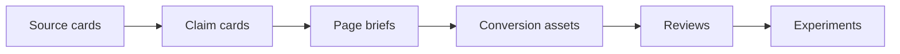

# Hermes Wiki Home

> [!info]
> This vault is the canonical content-asset store for thesis, cluster, source, claim, page brief, conversion asset, review, and experiment cards.

## Start here

- [[00 - Hermes Overview.base|Hermes Overview]]
- [[00 - Hermes Claims.base|Claim Library]]
- [[00 - Hermes Assets.base|Asset Library]]
- [[00 - Hermes Sources.base|Source Library]]
- [[00 - Hermes Signals.base|Review and Experiment Queue]]
- [[00 - MOC - AI Video Workflow|Current Active Thesis MOC]]
- [[00 - Hermes Wiki Schema|Schema and tagging rules]]

## Current active stack

- Thesis: [[01-theses/thesis.video-creation|AI Video Workflow]]
- Cluster: [[02-clusters/cluster.ai-video-workflow-short-form-demo|AI video workflow short-form demo]]
- Primary asset: [[06-assets/asset.ai-video-workflow-short-form-demo.prompt-pack|Prompt pack]]
- Supporting assets:
  - [[06-assets/asset.ai-video-workflow-short-form-demo.workflow-checklist|Workflow checklist]]
  - [[06-assets/asset.ai-video-workflow-short-form-demo.comparison-worksheet|Comparison worksheet]]
- Latest review: [[07-reviews/review.ai-video-workflow-short-form-demo.cf32dc11|Latest review decision]]
- Current experiment: [[08-experiments/experiment.ai-video-workflow-short-form-demo.rewrite-titles-descriptions-and-click-driving-visuals|CTR rewrite experiment]]

## Working loop

1. Review source coverage in [[00 - Hermes Sources.base|Source Library]].
2. Tighten or add reusable claims in [[00 - Hermes Claims.base|Claim Library]].
3. Check whether the page brief still matches the intent and CTA route in [[00 - MOC - AI Video Workflow|the thesis MOC]].
4. Verify the conversion asset is still deliverable in [[00 - Hermes Assets.base|Asset Library]].
5. Use [[00 - Hermes Signals.base|Review and Experiment Queue]] to decide whether to maintain, optimize, or expand.

## Vault map

- `01-theses/` thesis-level strategy and monetization guardrails
- `02-clusters/` cluster definition, keyword scope, and conversion path
- `03-sources/` evidence cards captured from official pages and SERP research
- `04-claims/` reusable content claims for pages and assets
- `05-page-briefs/` page-level control surface for template logic
- `06-assets/` conversion assets and delivery rules
- `07-reviews/` review outcomes and operating decisions
- `08-experiments/` next-run optimization ideas

## Reading order for a new thesis

## Operator notes

> [!note]
> `type` and `id` are the canonical routing properties. Tags are an Obsidian convenience layer for humans, not the system of record for the pipeline.

> [!tip]
> If you open the whole repo as the vault, keep this note pinned. If you open only `wiki/` as the vault, this note can stay your default landing page.
